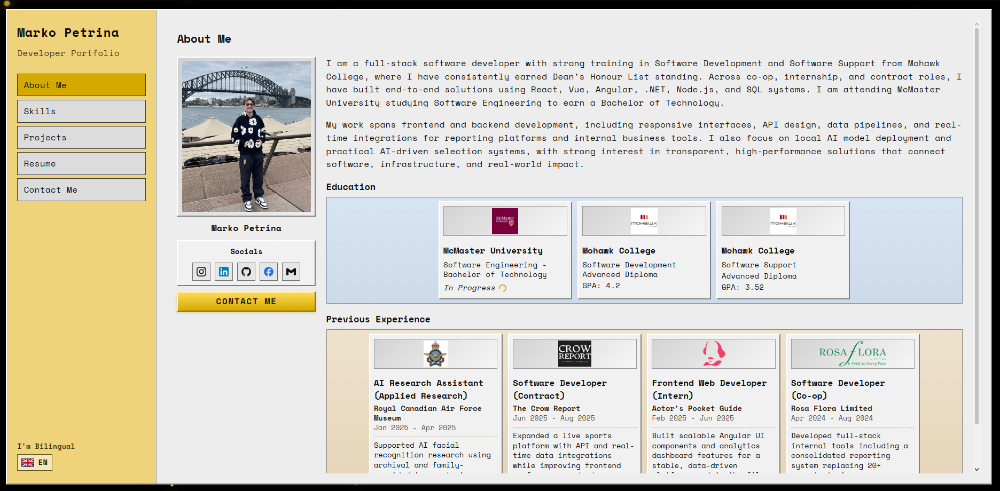

# Marko Petrina Portfolio

Retro-inspired bilingual developer portfolio with animated UI, project showcases, and an embedded resume viewer.

## Live Demo

https://markopetrins.github.io/portfolio/

## Features

- Retro desktop-style interface
- English/Croatian language toggle
- Education and experience highlight cards
- Skills dashboard with strengths and categorized tooling
- Project cards with GitHub redirect indicators
- Embedded resume viewer with download button
- Animated background particles and cursor trail

## Screenshot



## Run Locally

Because this is a static site, you can run it by opening `index.html` directly, or with a local server:

```powershell
python -m http.server 5500
```

Then open `http://localhost:5500`.

## Deploy on GitHub Pages

1. Push your code to this GitHub repository.
2. Open the repository on GitHub.
3. Go to `Settings` -> `Pages`.
4. Under **Build and deployment**:
   - **Source**: `Deploy from a branch`
   - **Branch**: `main`
   - **Folder**: `/ (root)`
5. Click `Save`.
6. Wait 1-3 minutes, then open the published URL.

## Project Structure

```text
.
|- index.html
|- styles.css
|- script.js
`- assets/
```

## Author

Marko Petrina
